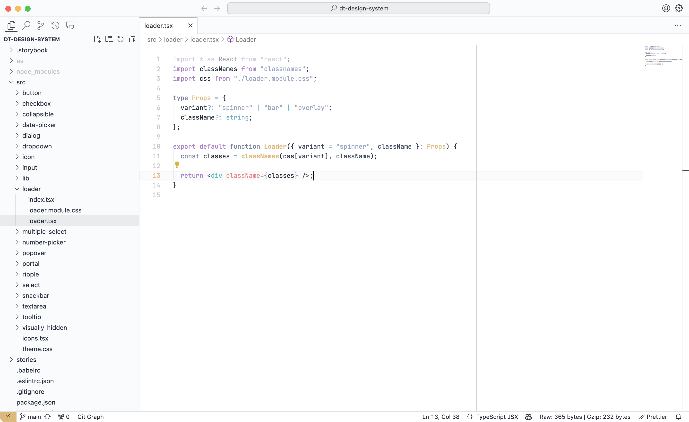

# Day Shift Theme

## Introduction

This theme's main goal is to provide a light, readable & clean experience into your favorite code editor.

In order to stay soft to the eyes, it uses a desaturated color palette and uses only bold characters for function names as they are what describes your code the better.

Visit [Night Shift website](https://jean-tinland.github.io/night-shift-demo/) for more info. You can find the dark version of this theme [here](https://marketplace.visualstudio.com/items?itemName=jean.desaturated).

You'll find an iTerm2 port of this theme [here](https://github.com/Jean-Tinland/iTerm2-theme-desaturated).\
A Google Chrome port is available [here](https://github.com/Jean-Tinland/chrome-theme-desaturated).

## Preview



## Colors

| Color                                                                   | Hex Code  | Used for                                                                                                                |
| ----------------------------------------------------------------------- | --------- | ----------------------------------------------------------------------------------------------------------------------- |
|  Deep dark blue | `#1e2737` | Variable names                                                                                                          |
|  Dark blue      | `#39465e` | Comments - Names entities - SCSS include, mixins params & parenthesis - CSS units - Regex - Parameters - Tag brackets   |
|  Medium blue    | `#74829b` | Storage keywords - Template expressions                                                                                 |
|  Light blue     | `#98a8c5` | Strings                                                                                                                 |
|  Blue           | `#6db3ce` | Tag brackets - Escape characters - Operators - Special operators - Provided (support) values                            |
|  Red            | `#e78482` | Tag attributes - Units - Pseudo CSS                                                                                     |
|  Green          | `#8fc8bb` | Static types - Provided values, functions, & variables - CSS constant variables                                         |
|  Yellow         | `#e0b972` | Function names - Regex - JSON property name - CSS transition name, ID selector - Inherited classes - Language variables |
|  Magenta        | `#ad82cb` | Constants - Pseudo CSS - Keywords                                                                                       |
|  Cyan           | `#2fc2c3` | Tags selector                                                                                                           |
|  White / yellow | `#fff9ee` | Variables names                                                                                                         |

## Installation

Launch VS Code Quick Open (⌘+P), paste the following command, and press enter.

`ext install jean.day-shift-theme`

Or install this theme from the extension panel : search for "_day shift theme_".

You can find this theme in the Visual Studio Code Marketplace.

## Customization

If you want to get rid of all bold or italic text, you can add these lines to your `settings.json` file :

```json
  "editor.tokenColorCustomizations": {
    "textMateRules": [
      // Remove bold
      {
        "name": "Function names",
        "scope": "entity.name.function",
        "settings": {
          "fontStyle": "",
        }
      },
      // Remove italics
      {
        "name": "Comments",
        "scope": "comment",
        "settings": {
          "fontStyle": "",
        }
      }
    ]
  },
```

If you want to override anything else, you can see all the style definitions [here](https://github.com/Jean-Tinland/vscode-theme-day-shift/blob/main/themes/color-theme.json#L101) in the github repo.

## Support

As I work mainly with **Javascript**, **Typescript**, **HTML/CSS** & **PHP**, these are for now the only fully supported languages.

Do not hesitate to contact me if you have some suggestions of improvements or language addition requests.
